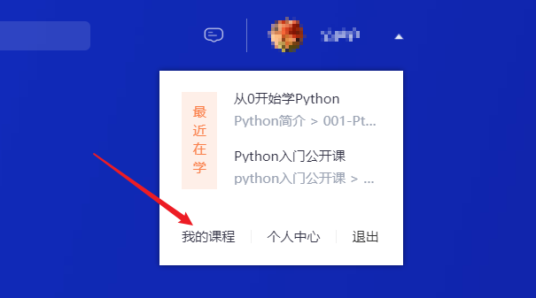
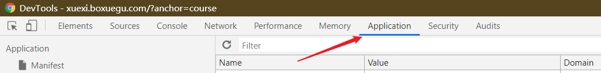
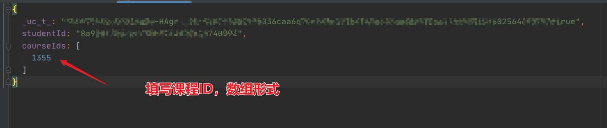

# boxuegu
博学谷视频下载

使用了 [fastjson](https://github.com/alibaba/fastjson) 、[m3u8Download](https://github.com/qq494257084/m3u8Download) 、[jsoup](https://github.com/jhy/jsoup)

# 使用方法

1. 使用chrome浏览器，打开博学谷官网并登录帐号
2. 打开我的课程
3. 按F12，打开DevTools，选择Application选项
4. 选择cookie字段填写配置文件

```bat
boxuegu.bat [custom.json]   //根据配置文件获取视频信息，并记录保存到data/目录中，默认配置为user.config
boxuegu.bat d video.json    //根据 video.json 下载视频到video/目录中
```

